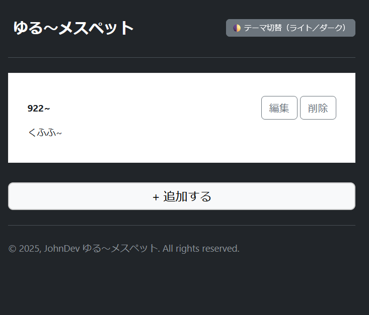
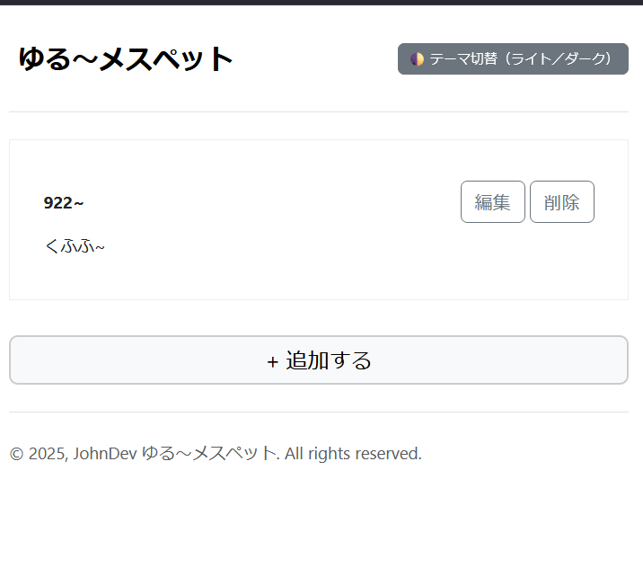
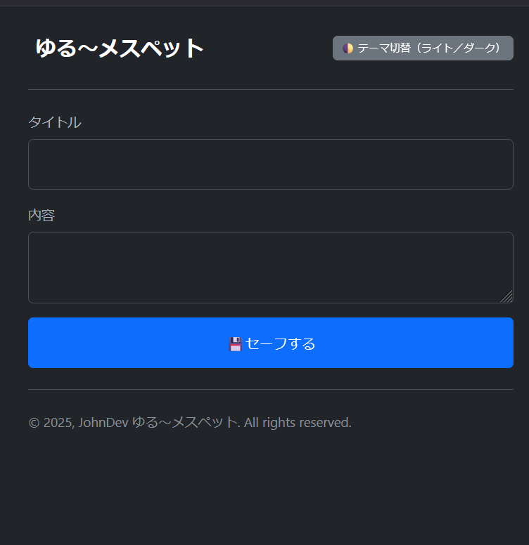
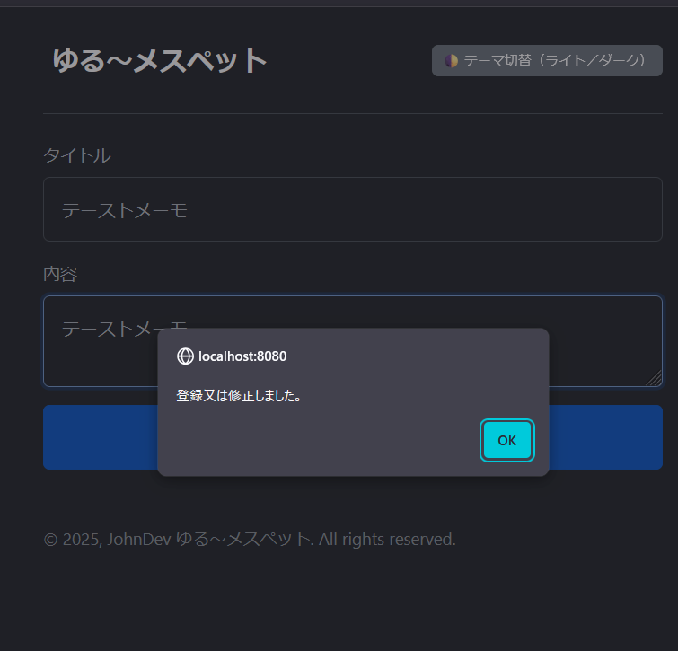
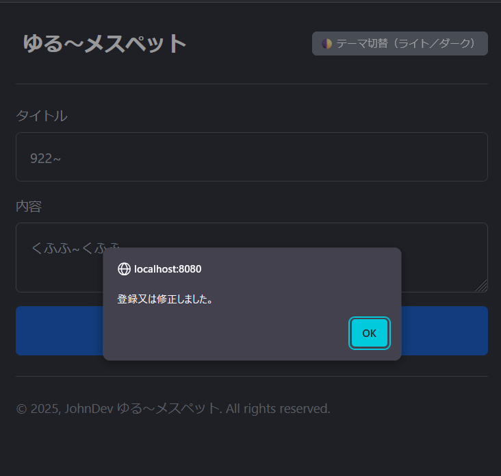
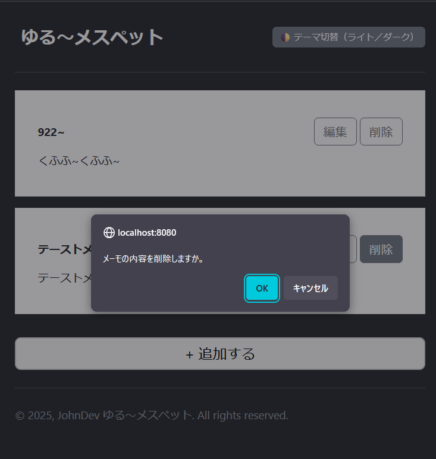
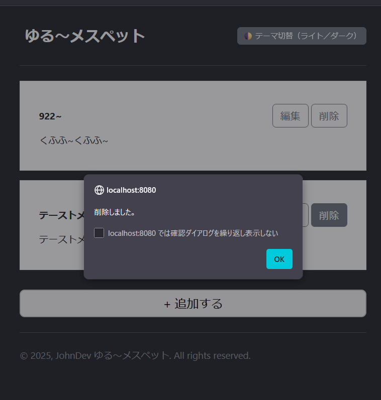

# yuru_messpad

メイン「ゆるアーカイブ」プロジェクトに追加する**公式**ミニプログラム（MFE モジュール）です。

## 📅 2025 年 08 月 14 日

「ゆる〜メスペット」リポジトリを作成しました。

このプロジェクトは、メインプログラム「ゆるアーカイブ」に
**正式に組み込まれる** MFE（Micro FrontEnd）ミニプログラムです。  
軽量かつ独立した構造により、メインアプリの一部として安定的に稼働します。

### 🛠 技術スタック

1. Vue 3
2. Bootstrap 5.3.0
3. TypeScript
4. SCSS

---

### 🎯 開発の背景・目的

本ミニプログラムは、「ゆるアーカイブ」の**公式拡張モジュール**として、  
より軽量かつ柔軟にコンポーネント単位での開発・配信を可能にすることを目的としています。

- **背景**  
  従来のモノリシック構造では、UI/UX 改善や新機能の反映に時間と工数がかかる課題がありました。  
  そこで MFE アーキテクチャを導入し、小規模単位で独立開発・テスト・デプロイができる仕組みを採用しました。

- **目的**
  - 部分的な機能更新を迅速に反映
  - 開発者間の作業分担を容易化
  - メインアプリの安定性を維持しつつ新機能を試験導入
  - UI/UX 改善サイクルの短縮

このアプローチにより、ユーザー体験の向上と開発効率の最適化を同時に実現します。

## 📅 2025 年 08 月 20 日

- テストに開発されたソースコードを GitHub にアップしました。
- メインプログラムである「ゆるアーカイブ」に適応させるためにポート番号を一致しました。(Port : 8080)

### 💡 実行できない場合

`vite.config.ts` に設定されたポート番号を変更した後、以下を実行してください:

```bash
npm run dev

- テストに使われたソースコードや不要なコードとコメントを整理しました。
```

**スナップショット**

- メイン画面
  

- メイン画面(テーマ変換)
  

- メイン画面(メーモ登録)
  
  
  .png>)

- メイン画面(メーモ修正)
  
  .png>)

- メイン画面(メーモ削除)
  
  
  .png>)

## License

This project is **NOT open source**.
All rights reserved by © 2025 John Dev.
Commercial use is strictly prohibited unless prior written permission is obtained.

```

```
